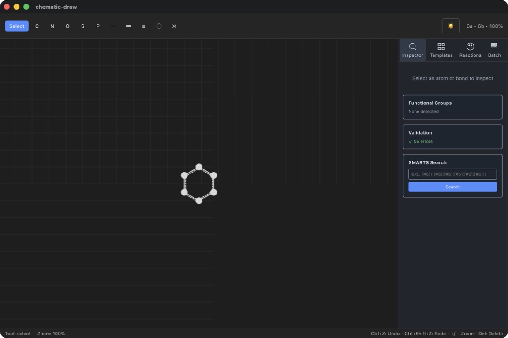

# chematic-draw

[日本語](README_ja.md) · [简体中文](README_zh.md)

[](https://github.com/kent-tokyo/chematic-draw/actions/workflows/test.yml)
[](https://github.com/kent-tokyo/chematic-draw/releases/latest)
[](docs/README.md)

An open-source, offline-first chemical structure editor for Windows, macOS,
and Linux. Draw molecules and reaction schemes, inspect local chemistry data,
and export figures or structure files without an account or required cloud
service. The desktop app uses Electron and React; chemistry runs locally in
the Rust/WASM bridge at [`crates/chem-wasm`](crates/chem-wasm).

chematic-draw is production-oriented for its documented workflows. It is a
practical option for students, researchers, teachers, and developers who need
everyday structure drawing, exchange, or review while keeping format and
presentation limits explicit.

Try the browser-only [Playground](https://kent-tokyo.github.io/chematic-draw/playground/),
or download the desktop app from [GitHub Releases](https://github.com/kent-tokyo/chematic-draw/releases).

## What you can do

- Draw and edit 2D structures with mouse, keyboard, templates, undo/redo,
  autosave, recovery, and ChemDraw-familiar or compact workspaces.
- Inspect properties, Lipinski rules, stereoisomers, SMARTS matches, ECFP4
  similarity, bounded MCS results, local 3D structures, and supported NMR data.
- Author reaction schemes, mechanism arrows, coefficients, and conditions;
  review structural-consistency diagnostics and run bounded multi-reactant
  SMIRKS transformations.
- Exchange SMILES, MOL V2000/V3000, SDF, CML, supported-subset CDXML, RXN,
  reaction JSON, SVG, PNG, PDF, and session bundles with explicit loss warnings.
- Use English, Japanese, or Simplified Chinese UI with dark mode. PubChem is
  an explicit network lookup; ChemSpider is an opt-in desktop-host integration.

## Moving a ChemDraw workflow

| Workflow | chematic-draw | Recommendation |
|---|---|---|
| Everyday 2D drawing and reaction schemes | Supported | Edit locally with templates, steps, and diagnostics. |
| SMILES, MOL, SDF, or CML exchange | Supported | Recommended for ordinary structure exchange. |
| Basic CDXML structure and page data | Supported subset | Test representative files before a migration. |
| Advanced templates, automatic layout, or exact publication composition | Partial | Use deterministic layout and SVG/PNG/PDF, but retain the source tool for final presentation review. |

This is a workflow guide, not a feature score. Read the [migration guide](docs/MIGRATION.md),
[format matrix](docs/INTEROP.md), and [known limitations](docs/KNOWN_LIMITATIONS.md)
before moving a production corpus.



## Start developing

```bash
git clone https://github.com/kent-tokyo/chematic-draw.git
cd chematic-draw/electron
npm install
npm run build:wasm
npm start
```

Node.js 24+, Rust, the `wasm32-unknown-unknown` target, and `wasm-pack` are
required. See [Quick Start](docs/QUICK_START.md) to install a release and
[Build](docs/BUILD.md) for development, testing, and packaging.

## Documentation and current development line

The [documentation index](docs/README.md) is the starting point for user,
format, API, and release-boundary documentation. The public data contract and
Electron-free embedding package are documented in
[`packages/chematic-contract`](packages/chematic-contract/README.md) and
[`packages/chematic-web`](packages/chematic-web/README.md).

The published `v1.0.14` release uses `chematic` v1.0.31. The app is MIT-licensed; see [Contributing](CONTRIBUTING.md)
and [Security](SECURITY.md) for project policy.
