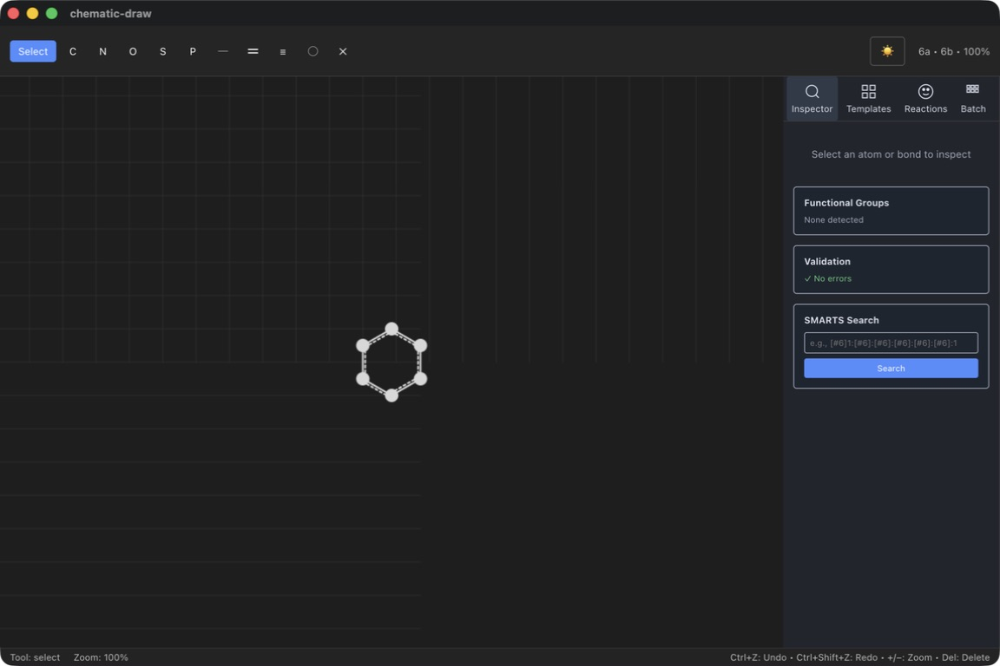

# chematic-draw

面向 Windows、macOS 和 Linux 的开源、离线优先化学结构编辑器。桌面应用使用
Electron 和 React 构建，化学操作由 [`crates/chem-wasm`](crates/chem-wasm)
中的 Rust/WASM 桥接层执行。

本项目仍处于实验阶段，并不是 ChemDraw、ChemDoodle、Ketcher 或 ChemSketch
的直接替代品。

## 功能

- 支持鼠标和键盘操作的二维分子画布
- 分子模板、Inspector、撤销/重做、自动保存和崩溃恢复
- 分子属性、Lipinski 检查、立体异构体枚举和 SMARTS 搜索
- 支持旋转、缩放和 XYZ 导出的三维查看器
- 反应方案、反应机理箭头和反应验证诊断
- 支持逐项结果、筛选、进度、取消和失败重试的批处理
- 支持 SMILES、MOL V2000/V3000、SDF 和 CML 导入导出；支持 CDXML 子集导入导出
- 支持 SVG、PNG 和 PDF 图形导出
- 通过生成的 InChIKey 查询 PubChem（需要网络连接）
- 英文、日文和简体中文界面、深色模式

## 截图



截图展示了桌面应用中的画布、Inspector、验证状态和 SMARTS 搜索功能。

## 快速开始

```bash
git clone https://github.com/kent-tokyo/chematic-draw.git
cd chematic-draw/electron
npm install
npm run build:wasm
npm start
```

开发和测试命令请参阅 [`docs/BUILD.md`](docs/BUILD.md)，发布版安装说明请参阅
[`docs/QUICK_START.md`](docs/QUICK_START.md)。

## 化学引擎

应用通过 WebAssembly 使用 Rust 化学信息学库
[`chematic`](https://crates.io/crates/chematic)。化学层不使用 C/C++ FFI；
Electron 和 Chromium 仍属于独立的原生依赖。

## 文档、贡献和许可证

已知限制和文档索引见 [`docs/README.md`](docs/README.md)，格式互操作性见
[`docs/INTEROP.md`](docs/INTEROP.md)。贡献指南见 [`CONTRIBUTING.md`](CONTRIBUTING.md)，
安全问题请参阅 [`SECURITY.md`](SECURITY.md)。本项目采用 MIT 许可证。
